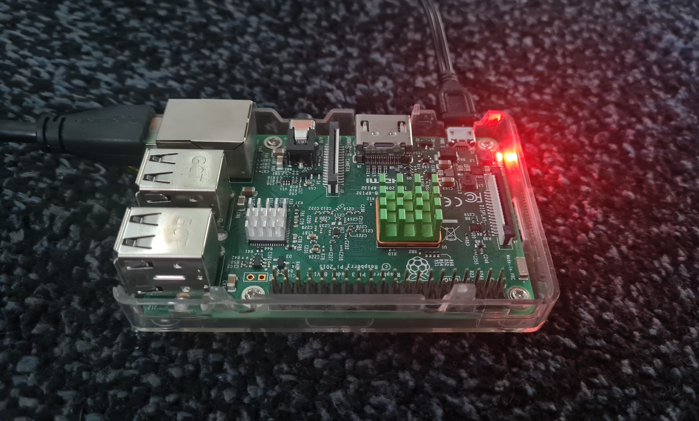

# Raspberrypi Server Backend
Dieses Projekt nutzt das Spring Framework um ein Backend mit einer PostgreSQL Datenbank auf meinem Raspberry Pi 3B+ zu hosten. Das Betriebssystem des Raspberry Pi 3B+ ist ein Ubuntu Server auf dem die Datenbank sowie das Backend (.war) gehostet wird. Der Server läuft 24/7.

Die Seite lässt sich erreichen, indem man einfach die IP (http://192.168.178.68/) des Raspberry eingibt, da das der einzige Service ist, der auf dem Server läuft. Hier ein Demonstrationsvideo der Seite:

https://user-images.githubusercontent.com/92476790/185794208-8cc5873a-4c9c-469b-bf4e-4740f33def1d.mp4

